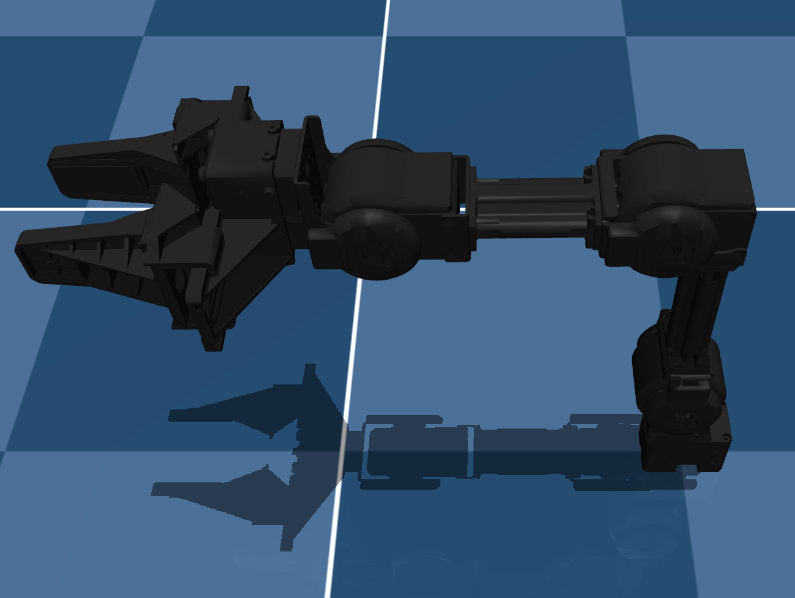
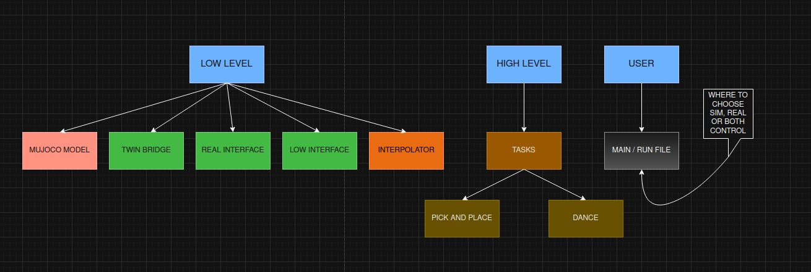

# 🤖 MuJoCo Robot Arm Simulation

<p align="center">
  
  
  
</p>

A simple and modular robotic arm simulation built using **MuJoCo**.
This project is designed for learning robotics, control systems, and simulation.

<p align="center">
  
</p>

---

## 🚀 Features

* 🦾 Robotic arm simulation in MuJoCo
* 🎯 Joint-level control
* 📊 Data logging for analysis
* 🧩 Clean and modular structure
* 🧪 Suitable for robotics and reinforcement learning experiments

---

## 📁 Project Structure

```
Mujoco---Robot-Arm---Simulation/
|-- assets/                    # Assets and resources
|-- config.py                  # Configuration settings
|-- dt_run.py                  # Digital twin running script
|-- interpolator.py            # Interpolation functions for trajectories
|-- open_manipulator_x.png     # Reference image of the manipulator
|-- open_manipulator_x.xml     # Robot model (MJCF format)
|-- real_interface.py          # Hardware interface for the real robot arm
|-- robot_tasks.py             # Defined tasks and movements
|-- scene.xml                  # Main MuJoCo simulation scene
|-- sim_interface.py           # Interface for the simulated robot
|-- sim_run.py                 # Simulation execution script
|-- twin_bridge.py             # Bridge logic for the digital twin
|-- LICENSE                    # Apache-2.0 License
|-- README.md                  # Project documentation

```
🏗 System Architecture

The project follows a hierarchical structure to ensure modularity and scalability, as shown in the system diagram:
1. Low-Level Layer

<p align="center">
  
</p>

This layer handles direct communication with the hardware or the physics engine.

    Interfaces (sim_interface.py & real_interface.py): These contain atomic functions such as:

        set_joint_position(angles): Commands specific angles to the motors or simulation.

        get_joint_state(): Reads current position, velocity, and effort.

    The Interpolator (interpolator.py): Acts as a motion profiler. Instead of the robot snapping instantly from 0∘ to 90∘ (which causes high jerk and potential hardware damage), the interpolator calculates a smooth trajectory.

2. High-Level Layer

    Tasks (robot_tasks.py): This module combines low-level atomic functions into complex behaviors.

        Example: A "Pick and Place" task coordinates: Move to target → Lower arm → Close Gripper → Lift.

        This layer abstracts the complexity, allowing you to trigger "Dance" or "Grasp" routines with a single command.

3. User Layer

    Main Execution (sim_run.py, dt_run.py): The entry point for the user. It initializes the environment and executes high-level tasks without needing to manage the underlying communication protocols.

📈 Trajectory Interpolation

The Interpolator is crucial for bridging the gap between discrete target points and continuous smooth motion. It ensures the robot moves within physical limits.

We implement trajectory generation where the position q(t) is calculated over a time step Δt:
q(t)=qstart​+(qend​−qstart​)⋅f(t)

Where f(t) is a smoothing function (Linear, Cubic Spline, or S-Curve). This prevents:

    Current Spikes: High torque demands on Dynamixel motors.

    Simulation Instability: "Explosions" in MuJoCo caused by massive instantaneous forces.

♊ Digital Twin Workflow

The project utilizes a Digital Twin concept to synchronize the physical Open Manipulator X with the MuJoCo virtual environment via twin_bridge.py.

    State Synchronization: The bridge reads the real-time joint angles from the hardware (qreal​) and updates the simulation state (qsim​) such that qsim​≈qreal​.

    Safety Pre-testing: You can validate a new robot_task in the simulation environment first. Once the trajectory is verified as collision-free, the same commands are piped to the real_interface.py.

Operational Flow:

    Establish connection to Dynamixel servos via real_interface.

    Initialize the MuJoCo engine with open_manipulator_x.xml.

    Run the twin_bridge loop to maintain parity between the physical and virtual assets.
    
## ⚙️ Installation

```
# Clone repository
git clone https://github.com/Harrylearn05/Mujoco---Robot-Arm---Simulation.git
cd Mujoco---Robot-Arm---Simulation

# Install dependencies
pip install dynamixel_sdk 

# Install MuJoCo
pip install mujoco
```

---

## ▶️ Usage

Run the simulation:

```
python3 sim_run.py
```

---

## 🎮 Simulation Capabilities

* Load robotic arm model (MJCF format)
* Perform joint-level control
* Visualize motion using MuJoCo viewer
* Simulate:

  * Free motion
  * Controlled movement
  * Interaction with environment

---

## 🧠 Learning Objectives

This project helps you understand:

* Robot kinematics and dynamics
* MuJoCo simulation workflow
* Control of articulated systems
* Data collection for robotics and AI

---
